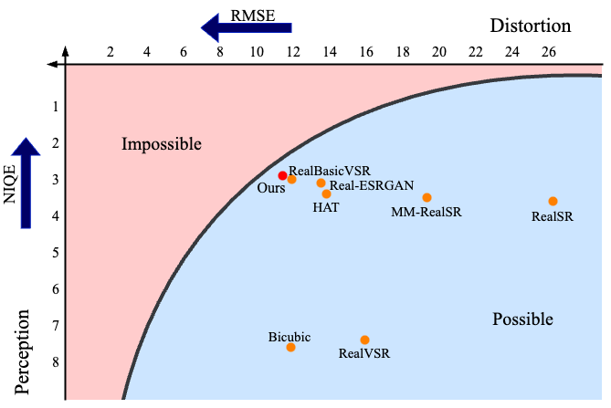
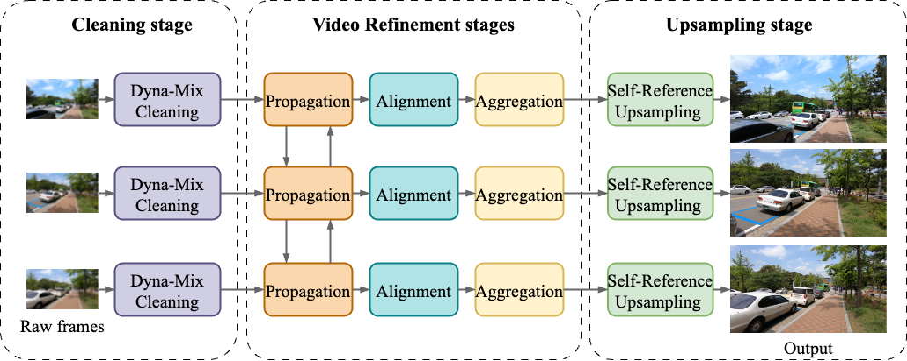
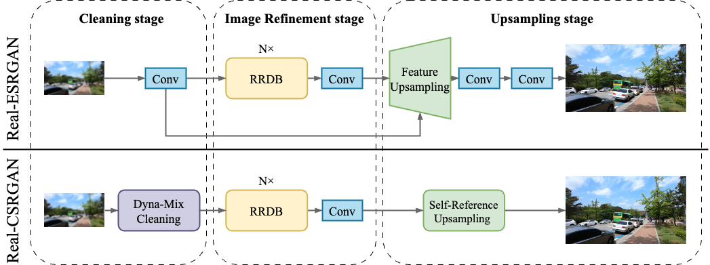
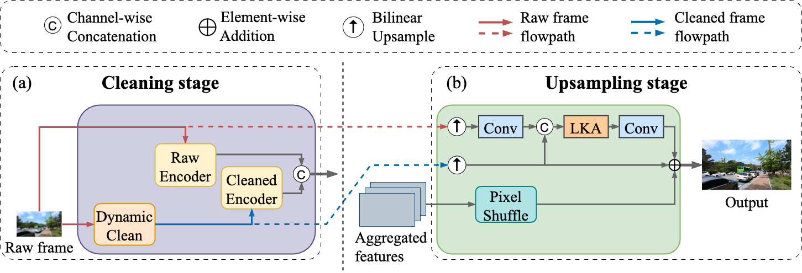

# RealCleanVSR

<p align="center">  </p>

## Introduction

This is the PyTorch implementation of the paper RealCleanVSR: Mitigating the Perception-Distortion trade-off in Real-World Super-Resolution.

## Abstract

As the average distortion decreases, the likelihood of accurately distinguishing the results of a restoration method from real images increases. This problem, commonly referred to as the Perception-Distortion trade-off, has garnered significant attention in the past decade. To mitigate this issue, most existing methods employ a Residual Cleaning process that generates degradation-free features to perform Upsampling, reducing the artifacts associated with perceptual measurement. However, the process of Cleaning images can unintentionally remove visual elements, indirectly affecting the Upsampling ability to retain information for distortion. Aiming to address the trade-off issue, we develop RealCleanVSR with two new modules: Dyna-Mix Cleaning and Self-Reference Upsampling. Our experiments show that the new modules can more efficiently leverage both distortion-oriented textures and perception-oriented information in each frame. In particular, our RealCleanVSR surpasses the recent RealBasicVSR by 0.33 dB in PSNR and 0.03 in NIQE.

## Overview

- [Installation](#installation)
- [Getting Started](#getting-started)
- [Pretrained Model](#pretrained-model)
- [Architecture](#architecture)
- [Citation](#citation)
- [Acknowledgement](#acknowledgement)

## Installation

### Installation Steps

a. Clone this repository.

```shell
git clone https://github.com/anony-github/realcleanvsr
```

b. Install the dependent libraries and setup models location:

```shell
cd realcleanvsr
python setup.py
 ```

## Getting Started

### Dataset Preparation

* RealCleanVSR: Please download the official [REDS](https://seungjunnah.github.io/Datasets/reds.html) dataset and organize the downloaded files as follows:

```
realcleanvsr
├── data
│   │── train
|   │   │── train_sharp
|   │   │   ├──000
|   │   │   ├──...
|   │   │── train_sharp_bicubic
|   │   │   ├──X4
|   │   │   │   ├──000
|   │   │   │   ├──...
│   │── val
|   │   │── val_sharp
|   │   │   ├──000
|   │   │   ├──...
|   │   │── val_sharp_bicubic
|   │   │   ├──X4
|   │   │   │   ├──000
|   │   │   │   ├──...
```

* Real-CSRGAN: Please follow the instructions in [Real-ESRGAN](https://github.com/xinntao/Real-ESRGAN/blob/master/docs/Training.md) for the dataset preparation.

### Training & Testing

#### Test and evaluate the pretrained models
* Test RealCleanVSR:
```shell
python tools/test.py configs/test_realcleanvsr.py pretrained/RealCleanVSR.pt   
```

* Test Real-CSRGAN:
```shell
python tools/test.py configs/test_real-csrgan.py pretrained/Real-CSRGAN.pt   
```

#### Train models:

* Train RealCleanVSR:
```shell
python tools/train.py configs/distortion-oriented_phase.py

python tools/train.py configs/perception-oriented_phase.py
```

* Train Real-CSRGAN:
```shell
python tools/train.py configs/real-csrgan_training.py
```

## Pretrained Model

To ease the usage, we provide the pretrained model at: [Google Drive](https://drive.google.com/drive/folders/1W4xh6wa4-4MVc4f1mujehlLgtJMu9cg4?usp=sharing)

Download and put the pretrained model in `pretrained` folder.

## Architecture
### RealCleanVSR
<p align="center">  </p>

### Real-CSRGAN
<p align="center">  </p>

### Dyna-Mix Cleaning and Self-Reference Upsampling
<p align="center">  </p>

## Citation

## Acknowledgement

This respository is heavily inspired by [MMagic](https://github.com/open-mmlab/mmagic). Thanks for their great works!